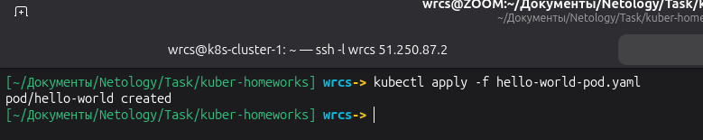
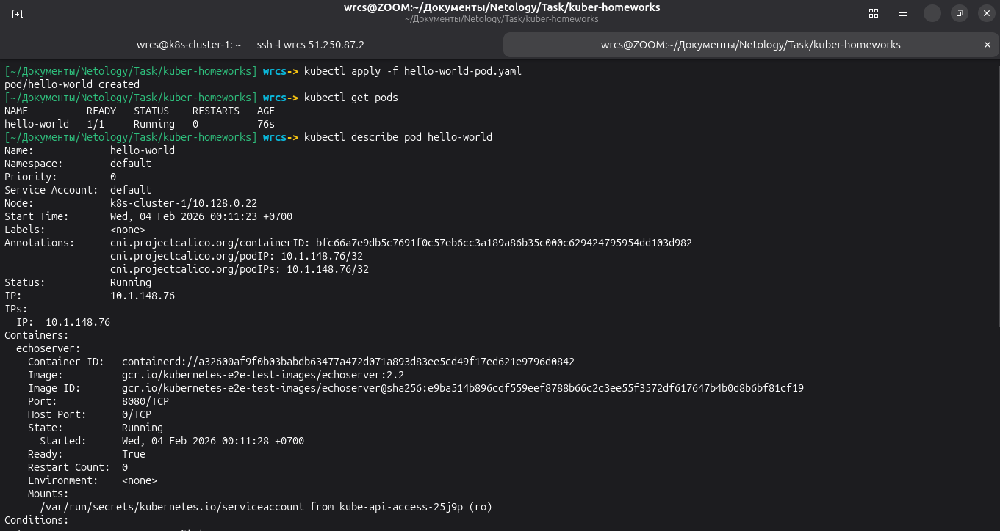
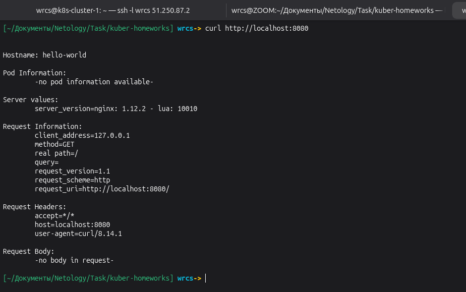
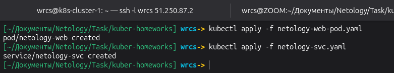
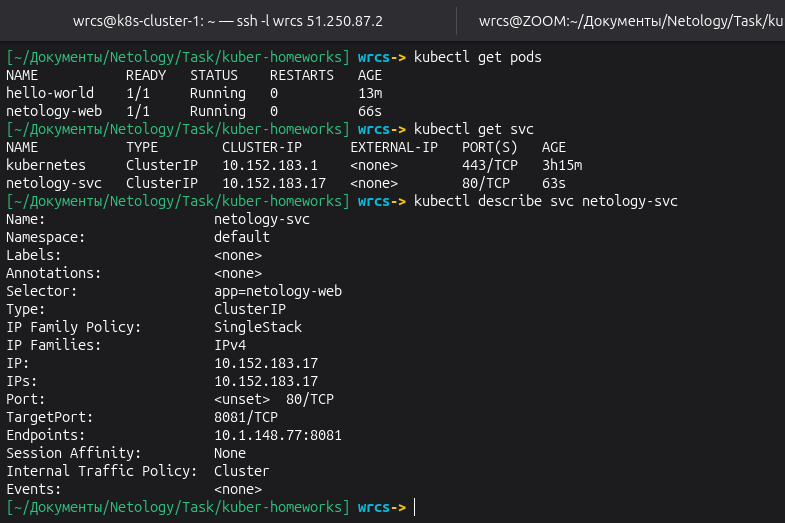
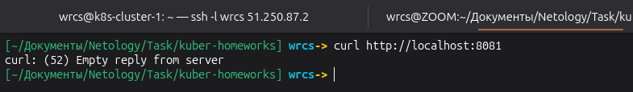

# Домашнее задание к занятию «Базовые объекты K8S» Малявко С.Н.

### Задание 1. Создать Pod с именем hello-world

### Задание 2. Создать Service и подключить его к Pod

### Файлы манифестов

- [hello-world-pod.yaml](hello-world-pod.yaml)
- [netology-svc.yaml](netology-svc.yaml)
- [netology-web-pod.yaml](netology-web-pod.yaml)

## ✅ ЗАДАНИЕ ВЫПОЛНЕНО
